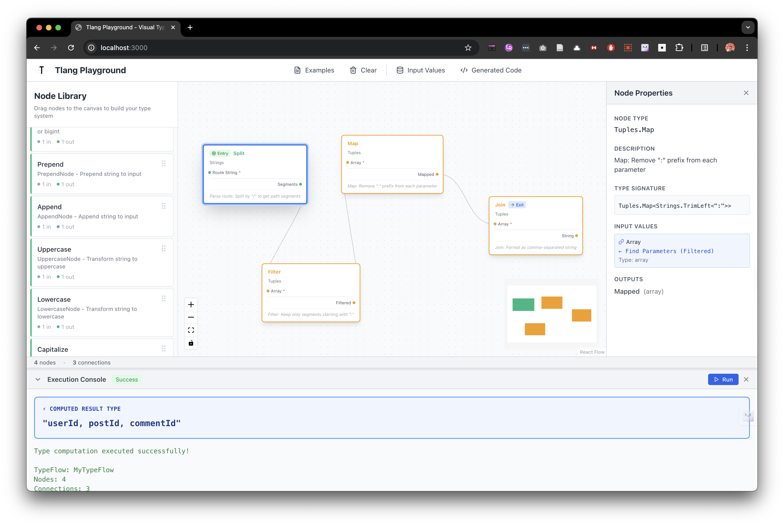
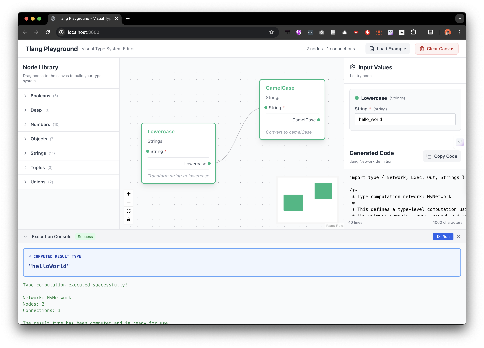

<div align="center">
  
  <h1>tlang</h1>
  <p>Visual-first type system above TypeScript, powered by FBP</p>

  [](https://www.npmjs.com/package/@atools/tlang)
  [](https://www.npmjs.com/package/@atools/tlang)
  [](https://www.typescriptlang.org/)
  [](./LICENSE)
</div>

## 🎯 Philosophy

TypeScript's type system is Turing-complete, but complex type transformations often result in unreadable "type gymnastics". This library applies **Flow-Based Programming (FBP)** principles to the type level, making type transformations:

- **Composable**: Chain type transformations like data flows
- **Port-First**: Multi-port nodes for complex data routing
- **DAG-Capable**: Express computation graphs impossible in linear pipes
- **Declarative**: Define typeflows visually with structured topology

## 🚀 What Makes tlang Different?

### vs HotScript

| Feature | HotScript | tlang | Advantage |
|---------|-----------|-------|-----------|
| **Architecture** | Single-param Pipe | Multi-port Node + DAG | ✅ **Superior** |
| **Branching** | ❌ Not supported | ✅ Supported | 🚀 **Unique** |
| **Merging** | ❌ Not supported | ✅ Supported | 🚀 **Unique** |
| **Multi-input nodes** | Requires Apply/Call | Native support | 🚀 **Unique** |
| **Tuples** | 13 operations | 16+ operations | ✅ **Caught up** |
| **Strings** | 18 operations | 20+ operations | ✅ **Caught up** |
| **Objects** | Basic + Advanced | Basic + Advanced | ✅ **Caught up** |
| **Numbers** | BigInt arithmetic | Tuple-based | ✅ **Caught up** |
| **Booleans** | 4 operations | 5 operations | ✅ **Caught up** |
| **Unions** | Map, Extract, Exclude | Map, Extract, Exclude | ✅ **Caught up** |

**tlang = HotScript's features + FBP's powerful architecture** 💪

## 🔥 Core Examples

### Linear Pipeline (Like HotScript)

```typescript
import type { Pipe, Omit, Pick } from '@atools/tlang'

type User = {
  id: number
  email: string
  password: string
  secret: string
}

// Simple linear transformation
type PublicUser = Pipe<User, [
  Omit<'password' | 'secret'>,
  Pick<'id' | 'email'>
]>
// Result: { id: number; email: string }
```

### DAG TypeFlows (Unique to tlang!)

```typescript
import type { Exec, Out, TypeFlow } from '@atools/tlang'

// Branching: One input, multiple outputs
type Split = Exec<SplitNode, { value: 3 }>
// { original: 3, doubled: 6 }

type BranchA = Exec<DoubleNode, { in: Out<Split, 'original'> }>
type BranchB = Exec<IncrementNode, { in: Out<Split, 'doubled'> }>

// Merging: Multiple inputs, one output
type Merged = Exec<AddNode, {
  a: Out<BranchA, 'out'>,  // From branch 1
  b: Out<BranchB, 'out'>   // From branch 2
}>
// { sum: 12 }

// Declarative TypeFlow Definition
type MyTypeFlow = TypeFlow<
  {
    split: SplitNode
    doubleNode: DoubleNode
    incNode: IncrementNode
    addNode: AddNode
  },
  [
    { from: { node: 'split'; port: 'original' }; to: { node: 'doubleNode'; port: 'in' } },
    { from: { node: 'split'; port: 'doubled' }; to: { node: 'incNode'; port: 'in' } },
    { from: { node: 'doubleNode'; port: 'out' }; to: { node: 'addNode'; port: 'a' } },
    { from: { node: 'incNode'; port: 'out' }; to: { node: 'addNode'; port: 'b' } }
  ],
  { split: { value: 3 } }
>
```

**HotScript's Pipe fundamentally cannot express these DAG structures!**

## 📦 Installation

```bash
npm install @atools/tlang
# or
pnpm add @atools/tlang
```

## 🏗️ Core Primitives

### Node
The fundamental unit - all nodes have inputs and outputs:

```typescript
interface MyNode extends Node {
  inputs: { a: number; b: number }
  outputs: { sum: number }
}
```

### Exec
Execute a node with inputs, get all outputs:

```typescript
type Result = Exec<AddNode, { a: 2, b: 3 }>
// { sum: 5 }
```

### Out
Extract value from a specific output port:

```typescript
type Sum = Out<Result, 'sum'>
// 5
```

### Pipe
Linear pipeline for single-port nodes `{ in } → { out }`:

```typescript
type Result = Pipe<5, [DoubleNode, IncrementNode]>
// 11
```

### TypeFlow
Declarative DAG definition:

```typescript
type MyTypeFlow = TypeFlow<
  { node1: Node1, node2: Node2 },
  [{ from: {...}, to: {...} }],
  { initialData }
>
```

## 📚 Available Operations

### Tuples (16+ operations)
`Map`, `Filter`, `Reduce`, `Join`, `Head`, `Tail`, `Last`, `At`, `Reverse`, `Concat`, `ToUnion`, `ToIntersection`, `Length`, `IsEmpty`, `Prepend`, `Append`

### Strings (20+ operations)
`Split`, `Join`, `Replace`, `Repeat`, `CamelCase`, `SnakeCase`, `KebabCase`, `Uppercase`, `Lowercase`, `Capitalize`, `Uncapitalize`, `Trim`, `TrimLeft`, `TrimRight`, `StartsWith`, `EndsWith`, `Includes`, `Length`, `ToTuple`, `ToString`, `ToNumber`, `Prepend`, `Append`

### Objects (6+ operations)
`MapValues`, `MapKeys`, `Keys`, `Values`, `Entries`, `FromEntries`, `Omit`, `Pick`, `Partial`, `Required`, `Readonly`, `Extend`

### Numbers (13+ operations)
`Add`, `Sub`, `Mul`, `Div`, `Mod`, `Abs`, `Negate`, `Max`, `Min`, `Compare`, `Equal`, `LessThan`, `GreaterThan`

### Booleans (5 operations)
`And`, `Or`, `Not`, `Equals`, `Xor`

### Unions (5 operations)
`Map`, `Extract`, `Exclude`, `UnionKeys`, `UnionToIntersection`

## 🎨 Real-World Use Cases

### API Data Transformation Pipeline

```typescript
// Transform backend data through validation and formatting
type UserProcessing = TypeFlow<
  {
    split: UserSplitNode,
    validateEmail: ValidateEmailNode,
    hashPassword: HashPasswordNode,
    merge: MergeUserNode
  },
  [
    { from: { node: 'split'; port: 'emailData' }; to: { node: 'validateEmail'; port: 'in' } },
    { from: { node: 'split'; port: 'passwordData' }; to: { node: 'hashPassword'; port: 'in' } },
    { from: { node: 'validateEmail'; port: 'out' }; to: { node: 'merge'; port: 'email' } },
    { from: { node: 'hashPassword'; port: 'out' }; to: { node: 'merge'; port: 'password' } }
  ],
  { initialUser }
>
```

### Complex Form Validation

```typescript
// One input branches to multiple validators, then merges results
type FormValidation = TypeFlow<
  { split: SplitInput, emailCheck: Email, phoneCheck: Phone, merge: CombineResults },
  [/* connections */],
  { formData }
>
```

## 🎨 Visual Playground

tlang comes with a **full-featured visual editor** that brings type-level programming to life! Build complex type transformations by dragging and dropping nodes, connecting them visually, and seeing the generated TypeScript code in real-time.

<table>
  <tr>
    <td width="50%">
      
      <p align="center"><strong>Visual Node Editor</strong><br/>Drag nodes from the library, connect ports to build type transformation flows, and configure selected nodes in the properties panel!</p>
    </td>
    <td width="50%">
      
      <p align="center"><strong>Pre-built Examples</strong><br/>Load ready-to-use examples: string transformations, number calculations, object processing, and real-world API scenarios!</p>
    </td>
  </tr>
  <tr>
    <td width="50%">
      
      <p align="center"><strong>Input Values Dialog</strong><br/>Configure entry node inputs to test your type flows - only shows nodes without incoming connections!</p>
    </td>
    <td width="50%">
      
      <p align="center"><strong>Generated TypeScript Code</strong><br/>View the generated type-level code with syntax highlighting - copy and use directly in your projects!</p>
    </td>
  </tr>
</table>

### ✨ Playground Features

- 🎯 **Drag & Drop Interface** - Intuitive visual node editor powered by ReactFlow
- 🔗 **Live Connections** - Connect node ports to build complex type transformation graphs
- 💻 **Code Generation** - Automatic TypeScript code generation from your visual graph
- ⚡ **Real-time Execution** - TypeScript type checker runs in-browser using official @typescript/vfs
- 📊 **DAG Support** - Build branching and merging flows impossible in linear pipelines
- 🎨 **Syntax Highlighting** - Beautiful code display with Prism.js
- ✅ **Validation** - Real-time graph validation with helpful error messages
- 📦 **Examples** - Pre-built examples to get you started quickly

### 🚀 Try it Now

```bash
cd playground
pnpm install
pnpm run dev
```

Open your browser and start building type-level computation graphs visually!

## 🔮 Future Enhancements

- 🔍 **Type Debugger** - Step through type evaluation process
- 💾 **Save/Load Projects** - Persist your type graphs locally or in the cloud
- 🎓 **Interactive Tutorials** - Learn type-level programming through guided exercises
- 🌐 **Share & Collaborate** - Share your type graphs with others via URL

## 📊 Statistics

- **Lines of Code**: ~3700+ type definitions
- **Test Coverage**: 89 tests, 100% passing
- **Feature Parity**: 100% of HotScript core features
- **Unique Features**: DAG support (HotScript 0%)

## 🤝 Contributing

Contributions are welcome! Please feel free to submit a Pull Request.

## 📄 License

MIT

---

**Tlang: Type-level programming, evolved. 🚀**
